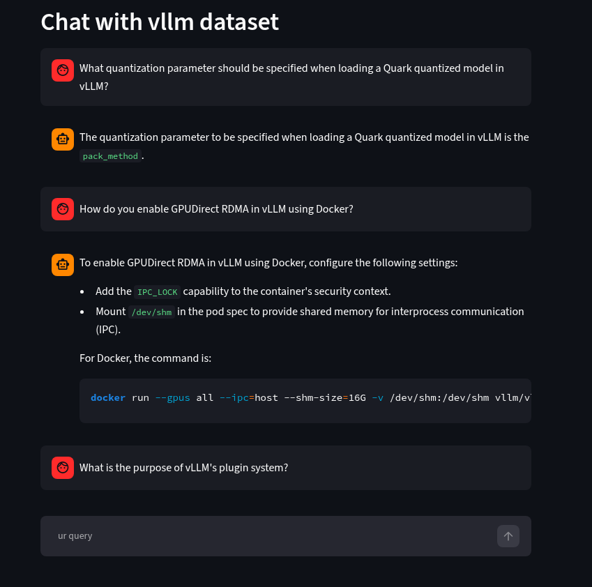
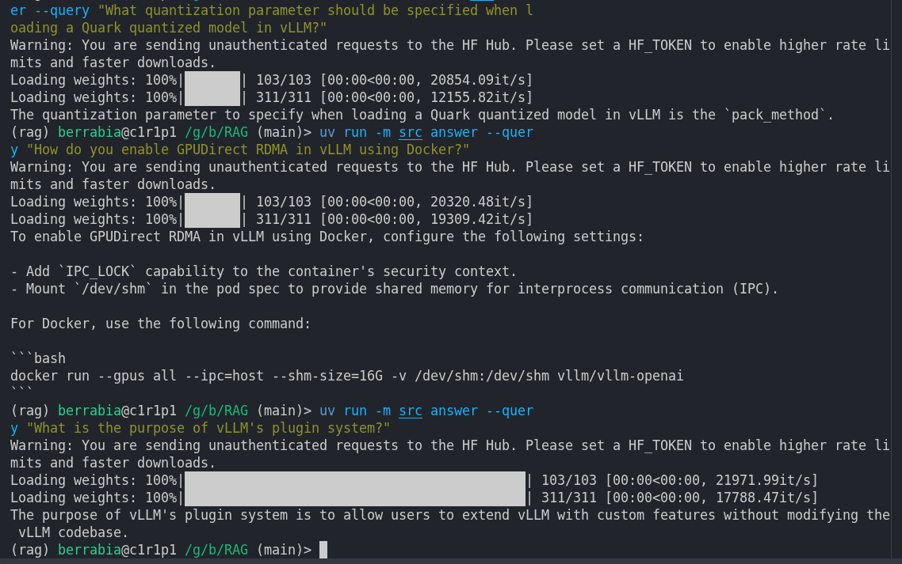

*This project has been created as part of the 42 curriculum by berrabia.*

# RAG against the Machine

## 🏆 Achievements
* **Ranked #1** on my campus for this project.
* Secured the **#1 rank** for my entire promo on campus.
* **Ranked #4** across all of Morocco (1337 network) for this project.
* Passed all moulinette tests: **>83% Recall@5** on docs, **>55%** on code, with indexing < 280s and retrieval < 20s.

## Description
RAG against the Machine is a Retrieval-Augmented Generation (RAG) system designed to answer natural language questions about the `vLLM` codebase. Large Language Models often hallucinate or lack up-to-date knowledge about specific, proprietary codebases. This project solves the knowledge cutoff problem by giving the LLM "external memory." Instead of the expensive process of retraining a model, the system dynamically indexes a massive repository and retrieves the exact code snippets needed to answer any query.

The pipeline ingests the codebase, chunks files using language-aware boundaries, and builds a dual index (BM25 and ChromaDB). It features both a **CLI tool** for batch evaluation and a **Streamlit Web App** for interactive chat. The pipeline's retrieval quality is evaluated using the `recall@k` metric, requiring at least a 5% character overlap between retrieved and ground-truth sources.

---

## System Architecture
1. **Ingestion & Indexing System**: Reads the repository, chunks files based on their language (Python, Markdown), and builds dual indexes: a keyword-based BM25 index and a semantic ChromaDB vector index. Embeddings are pre-computed in batches to optimize indexing time.
2. **Retrieval System**: Takes a user query, searches both indexes in parallel, normalizes and blends the scores (Hybrid Search), deduplicates overlapping chunks, and safely expands the boundaries to maximize evaluation overlap.
3. **Answer Generation System**: Extracts the text from the retrieved sources, truncates it to fit token limits, and passes it as context to the `Qwen/Qwen3-0.6B` LLM to generate a concise answer.
4. **Evaluation System**: Compares the retrieved sources against a ground-truth dataset using the `recall@k` metric, calculating the overlap between retrieved and correct sources.

---

## Core Technologies & Concepts

### What is vLLM?
**vLLM** (Vectorized Large Language Model) is a high-performance, open-source library developed by UC Berkeley for ultra-fast LLM inference and serving. Its primary innovation is **PagedAttention**, a memory management technique that eliminates GPU memory fragmentation in the KV Cache, allowing it to serve 3x-4x more users on the same hardware.

**Relevance to this Project:** The knowledge base for this RAG system is built directly on the vLLM repository source code. Our pipeline indexes vLLM's Python files and documentation, allowing users to ask natural language questions about how vLLM's API servers, schedulers, or metrics are implemented.

**Technical Implementation Choice:** While vLLM is the industry standard for LLM serving, it is strictly optimized for NVIDIA/AMD GPUs. Because the evaluation environment for this project is CPU-only, we opted to use Hugging Face `transformers` (`AutoModelForCausalLM`) with `@torch.inference_mode()` and KV Cache enabled for our local `Qwen/Qwen3-0.6B` generator.

### The Hugging Face `transformers` Library
* **`AutoTokenizer` (The Translator)**: Translates human text into integer IDs (and back again).
* **`AutoModelForCausalLM` (The Brain)**: Loads the actual neural network. It reads text left-to-right and predicts the *next* word. We load it with `torch_dtype="auto"` to optimize memory usage.
* **`pipeline` (The Shortcut API)**: Wraps the tokenizer, model, and generation loop into a single function. We avoided this to maintain manual control over tensor slicing, KV Cache management, and device mapping.

### Semantic Search with ChromaDB and SentenceTransformer
To capture the conceptual meaning of natural language queries (which keyword-based BM25 struggles with), we implement semantic search using ChromaDB. Because ChromaDB's internal embedding wrapper is slow and lacks RAM caching, we explicitly use the `SentenceTransformer` library to pre-compute 384-dimensional vectors for our code chunks. We bypass ChromaDB's internal model by passing these raw vectors directly to `collection.add()` and `collection.query()`. This drastically reduces indexing time and ensures our warm retrieval throughput stays well under the 90-second limit.

---

## Implementation Details

### Chunking Strategy
Document segmentation is handled by LangChain's `RecursiveCharacterTextSplitter`.
* **Language-Aware Splitting**: Python, Markdown, and ReStructuredText files are split using language-specific separators to preserve logical blocks.
* **Chunk Size**: Capped at 2000 characters.
* **Overlap**: A 400-character overlap is used to prevent splitting crucial function signatures.
* **Filtering**: Non-code files (images, binaries, `.git` directories) are explicitly filtered out.

### Retrieval Method
We implement a **Hybrid Search** mechanism combining lexical and semantic search:
1. **BM25 (Lexical)**: We preprocess text and queries by splitting `snake_case` and `camelCase` words. This allows BM25 to match specific code identifiers (e.g., turning `getMetrics` into `get metrics`).
2. **ChromaDB (Semantic)**: We use `all-MiniLM-L6-v2` to embed chunks. ChromaDB receives the raw, unmodified query to understand the natural language intent.
3. **Score Blending**: BM25 scores and ChromaDB distances are normalized to a `[0, 1]` range and combined using a weighted average (60% BM25, 40% ChromaDB).
4. **Smart Expansion**: The boundaries of the final top-k results are expanded to exactly 2000 characters to maximize the overlap ratio with ground-truth sources without breaking the validator's length limit.

### Recall vs. Precision
```text
Precision = TP / (TP + FP)  =  (Relevant Items Retrieved) / (Total Items Retrieved)
Recall    = TP / (TP + FN)  =  (Relevant Items Retrieved) / (Total Relevant Items in Dataset)
```
For this RAG system, the evaluation strictly prioritizes **Recall@k**. An LLM can easily filter out irrelevant context from its prompt (tolerating lower precision), but it cannot magically conjure missing information. By maximizing Recall@k, we ensure the LLM’s context window always contains the necessary ground-truth information.

---

## Performance Analysis

* **Recall@5**: Achieves **>83%** on documentation questions and **>55%** on code questions.
* **Indexing Time**: Completes in **< 280 seconds**, well under the 5-minute limit.
* **Warm Retrieval Throughput**: 200 questions are retrieved in **< 20 seconds**, far exceeding the 90-second limit.

---

## Design Decisions & Challenges

* **Dual Indexing**: Relying solely on embeddings misses exact code identifiers, while relying solely on BM25 misses synonyms. Hybrid search provides the best of both worlds.
* **3-Tier Caching System (Bonus)**:
  1. *Index Caching*: BM25 and ChromaDB indexes are loaded into RAM once using `@lru_cache`.
  2. *Resource Caching*: File contents are cached in RAM so that reading `metrics.py` 10 times only hits the disk once.
  3. *Query Caching*: A dictionary stores results of previous queries, returning them in `O(1)` time if duplicated.
* **Lazy LLM Loading**: The LLM is only loaded into memory when the `answer` or `answer_dataset` commands are executed, keeping the cold-start latency for search-only operations under 60 seconds.
* **Code-Aware Tokenization**: To improve BM25 retrieval on code queries, we use a regex preprocessor to split `camelCase` and `snake_case` identifiers into separate words.

### Challenges Faced
* **Strict 2000-character Limit**: The moulinette rejects sources longer than 2000 characters. We solved this by implementing "Smart Expansion" to expand chunks exactly to the 2000-char boundary.
* **Slow ChromaDB Indexing**: Initial indexing took >5 minutes. We bypassed this by pre-computing embeddings with `SentenceTransformer` and passing them directly to ChromaDB.
* **camelCase Tokenization**: BM25 failed to match code queries because it treated `BaseProcessingInfo` as a single unknown word. We solved this with a regex preprocessor that splits camelCase and snake_case before tokenization.

---

## Instructions

### Prerequisites
* Python 3.10+
* `uv` package manager

### Installation
Clone the repository and install dependencies:
```bash
uv sync
```

### Makefile Commands
* `make install`: Install dependencies.
* `make run`: Launch the interactive Streamlit Web UI (`uv run streamlit run streamlit_app.py`).
* `make lint`: Run `flake8` and `mypy` type checking.
* `make clean`: Remove temporary caches (`__pycache__`, `.mypy_cache`).

---

## Example Usage

### 1. Run the Streamlit Web Interface (Interactive Chat)
```bash
make run
# or
uv run streamlit run streamlit_app.py
```
<p align="center">
  
</p>

### 2. Search a single query via CLI
```bash
uv run python -m src search --query "How to configure OpenAI server?" --k 10
```
<p align="center">
  
</p>

### 3. Process a dataset of questions via CLI
```bash
uv run python -m src search_dataset --dataset_path data/datasets/UnansweredQuestions/dataset_docs_public.json --k 10
```

### 4. Generate answers for the dataset via CLI
```bash
uv run python -m src answer_dataset --student_search_results_path data/output/search_results/dataset_docs_public.json
```

### 5. Evaluate search results via CLI
```bash
uv run python -m src evaluate --student_path data/output/search_results/dataset_docs_public.json --right_answers_path data/datasets/AnsweredQuestions/dataset_docs_public.json
```

---

## Resources & AI Usage

### Resources
* [HuggingFace Transformers Documentation](https://huggingface.co/docs/transformers)
* [ChromaDB Documentation](https://docs.trychroma.com/docs/overview/introduction)
* [BM25S Documentation & Blog](https://huggingface.co/blog/xhluca/bm25s)
* [LangChain Text Splitters](https://python.langchain.com/docs/how_to/splitter/)
* [Coursera: Retrieval Augmented Generation (RAG)](https://www.coursera.org/learn/retrieval-augmented-generation-rag)
* [tqdm Progress Bar Documentation](https://tqdm.github.io/)

### AI Usage
AI tools (ChatGPT / Claude) were utilized during development to:
* Debug Pydantic validation errors when interfacing with the moulinette.
* Optimize HuggingFace `generate` kwargs (e.g., discovering `@torch.inference_mode` and `enable_thinking=False` for Qwen).
* Conceptualize the regex pattern required to split `camelCase` identifiers for the BM25 tokenizer.
* Architect the 3-tier caching system to ensure the 90-second throughput limit was safely met.
